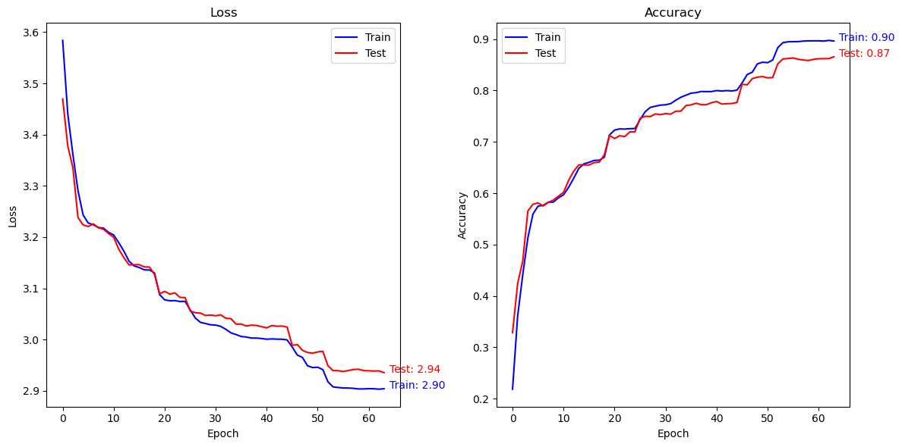

# Classification de panneaux de signalisation

Ce projet est inspiré d'un [TP Fidle](https://fidle.cnrs.fr/w3/). Il s'agit de reconnaitre des panneaux de signalisation allemands.

## Données

Les données sont disponibles sur [Kaggle](https://www.kaggle.com/datasets/meowmeowmeowmeowmeow/gtsrb-german-traffic-sign). Il s'agit de panneaux de signalisation Allemands.

Comme les données ne sont ni homogènes ni propres, il a fallu les prétraiter. J'ai donc créer plusieurs jeux de données avec des traitements différents.

## Modèles

J'ai testé plusieurs modèles de réseaux de neurones convolutifs pour tester différentes tailles d'image, différentes architectures, etc.

## Résultats

Je n'ai fait de tests qu'en utilisant 20% des données d'entrainement afin de limiter le temps de calcul. Les résultats ne sont donc pas aussi bons qu'ils pourraient l'être.

